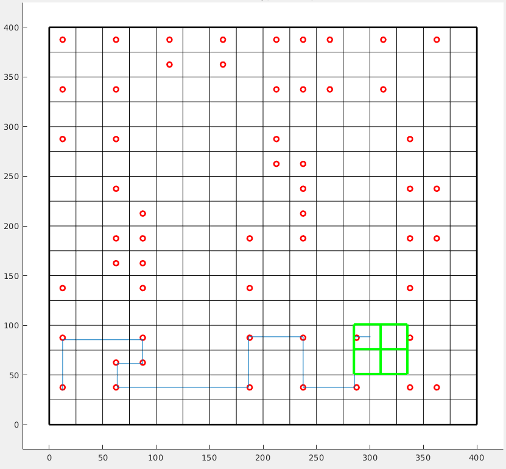
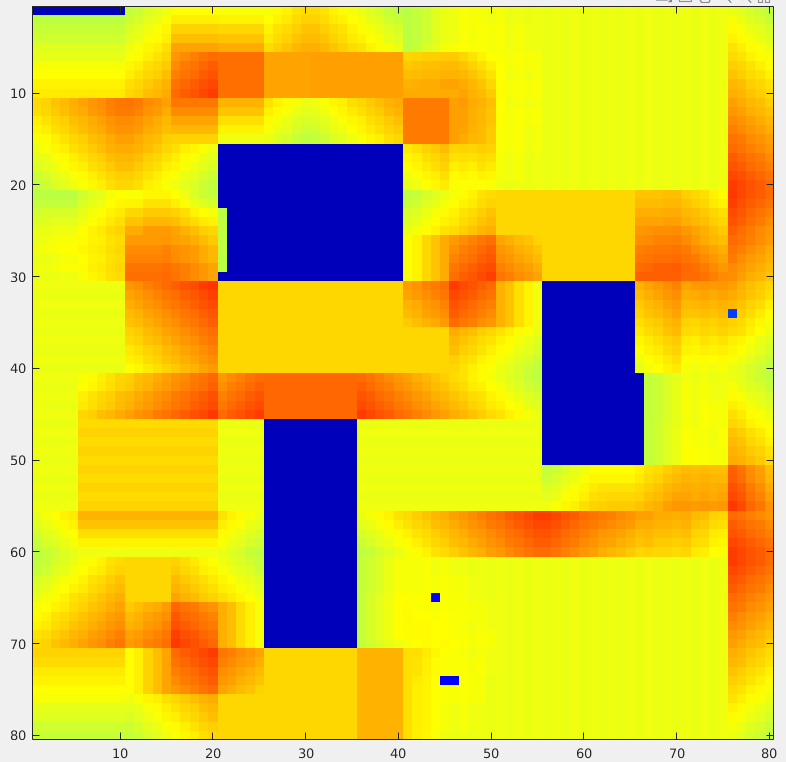

# MSR_waypoint_navigation

MSR_waypoint_navigation is a MATLAB path planning program developed for modular self reconfigurable robots (MSRs). Given a set of robot target waypoints, the program returns the best visiting sequence that yields the lowest navigation cost. The question is modeled as a typical travelling salesman problem (TSP). Path-planning techniques like A-Star(A*) are implemented in this program to solve for potential solutions. The program provides real-time navigation simulation in MATLAB with visual display of robot path and navigation heatmap. Preview images of the simulation are shown below.

&nbsp;&nbsp;&nbsp;&nbsp;&nbsp;&nbsp;&nbsp; 


## Software
 - MATLAB

## Publications

Please cite any of our paper if you use the code for your research.

- ***Graph Theory-Based Approach to Accomplish Complete Coverage Path Planning Tasks for Reconfigurable Robots*** ([Link to Paper](https://ieeexplore.ieee.org/abstract/document/8761971))
    - Citation through BibTeX:
    ```
    @article{ku2019,
    author={P. C. {Ku} and R. E. {Mohan} and N. H. K. {Nhan} and A. V. {Le}},
    journal={IEEE Access}, 
    title={Graph Theory-Based Approach to Accomplish Complete Coverage Path Planning Tasks for Reconfigurable Robots}, 
    year={2019},
    volume={7},
    pages={94642-94657}
    }
    ```

- ***Complete Path Planning for a Tetris-Inspired Self-Reconfigurable Robot by the Genetic Algorithm of the Traveling Salesman Problem***
([Link to Paper](https://www.mdpi.com/2079-9292/7/12/344/htm#))

    - Citation through BibTeX:
    ```
    @article{le2018,
    author = {Le, Anh Vu and Arunmozhi, Manimuthu and Veerajagadheswar, Prabakaran and Ku, Ping-Cheng and Minh, Tran Hoang Quang and Sivanantham, Vinu and Mohan, Rajesh Elara},
    title = {Complete Path Planning for a Tetris-Inspired Self-Reconfigurable Robot by the Genetic Algorithm of the Traveling Salesman Problem},
    journal = {Electronics},
    volume = {7},
    year = {2018},
    number = {12},
    DOI = {10.3390/electronics7120344}
    }
    ```
## Contact
Feel free to contact me through pku1@jhu.edu if you have any questions.
